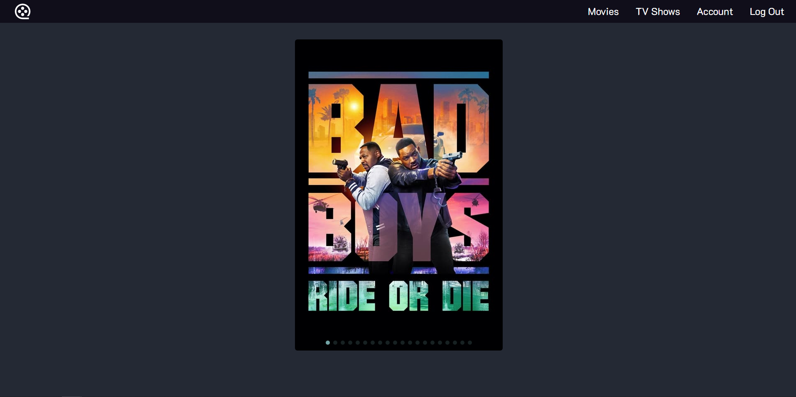
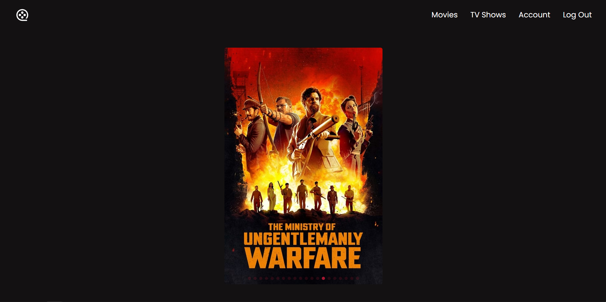
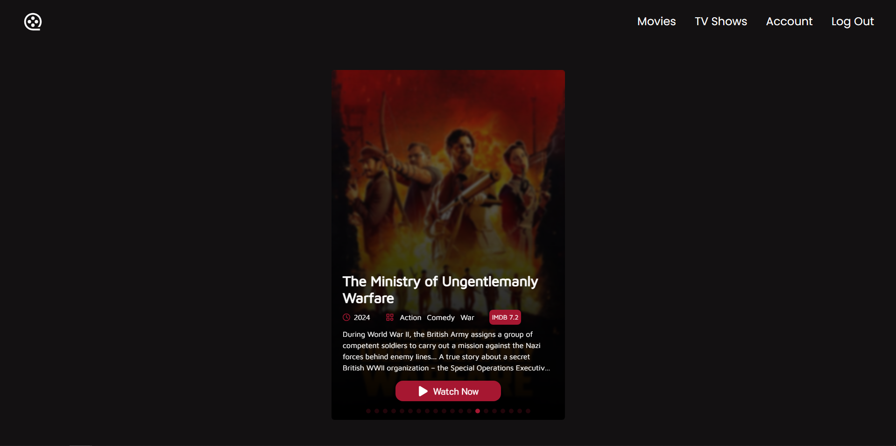
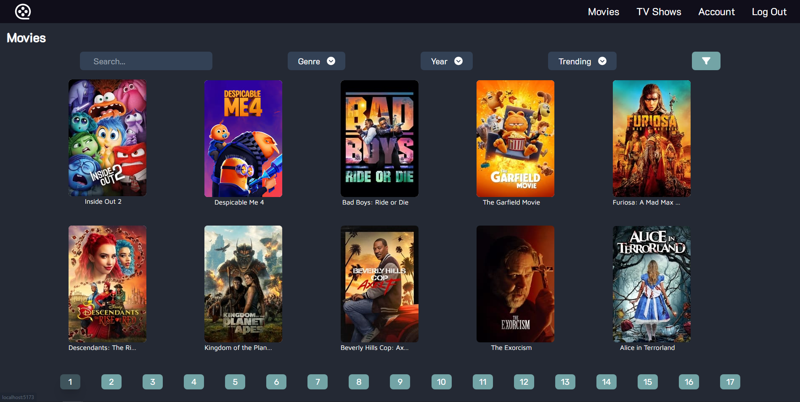
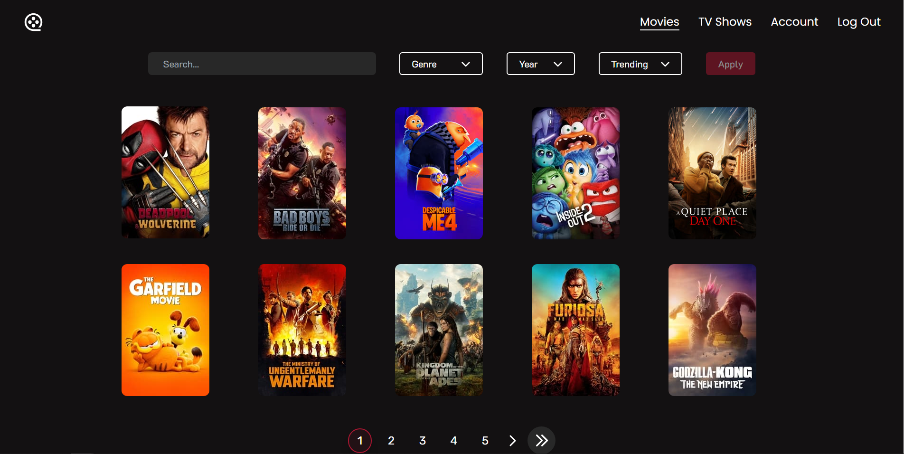
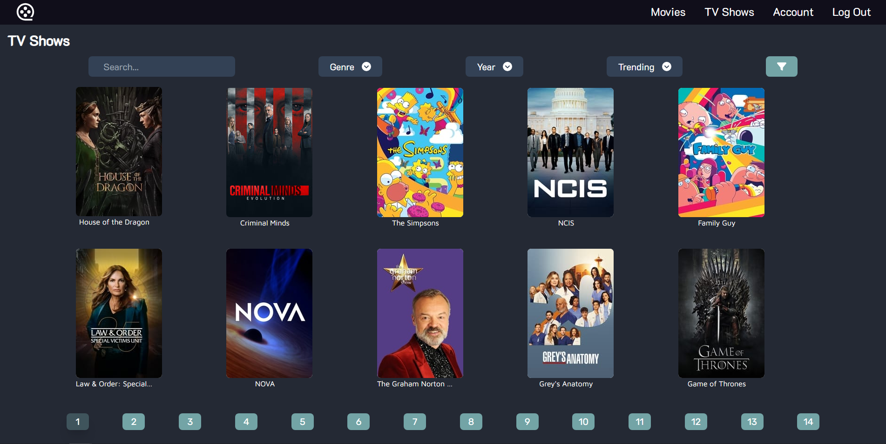
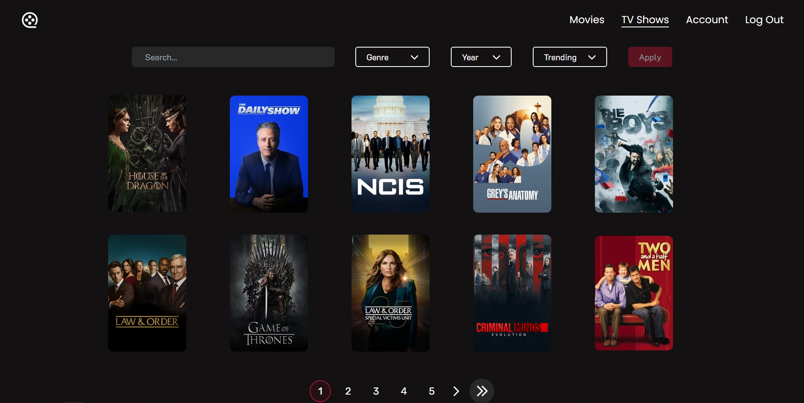

# Web Application UI Comparison

This document provides a visual comparison of the application's interface
across different versions. Each comparison set showcases the _'before'_ and
_'after'_ states of key features or components highlighting the design
and functionality evolution of the user interface.

Before and After Comparisons

| Before                                   | After                                     |
| ---------------------------------------- | ----------------------------------------- |
|     |       |
| _Feature Not Implemented_                |  |
|       |         |
|  |    |

